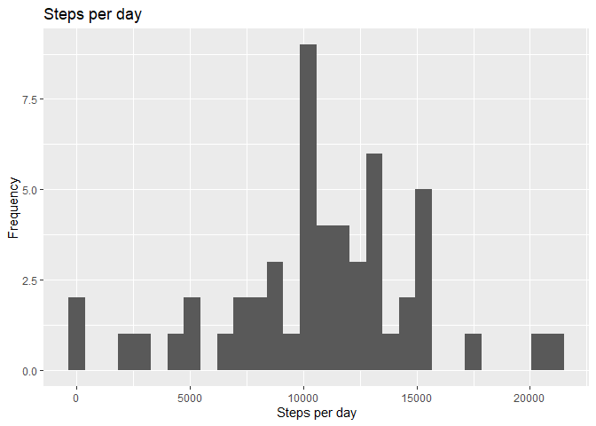

First of all, thanks for your time

## Loading and preprocessing the data

Here are the packages used.


```r
library(dplyr)
library(ggplot2)
library(lubridate)
library(magrittr)
```

Now let's load the data into a data frame.


```r
data_act <- read.csv("activity.csv", header = TRUE)
data_act %<>% mutate(date = ymd(date))
head(data_act)
```

```
##   steps       date interval
## 1    NA 2012-10-01        0
## 2    NA 2012-10-01        5
## 3    NA 2012-10-01       10
## 4    NA 2012-10-01       15
## 5    NA 2012-10-01       20
## 6    NA 2012-10-01       25
```

```r
dim(data_act)
```

```
## [1] 17568     3
```

```r
str(data_act)
```

```
## 'data.frame':	17568 obs. of  3 variables:
##  $ steps   : int  NA NA NA NA NA NA NA NA NA NA ...
##  $ date    : Date, format: "2012-10-01" "2012-10-01" ...
##  $ interval: int  0 5 10 15 20 25 30 35 40 45 ...
```

## What is the mean total number of steps taken per day?

So, let's group the data by day and calculate the sums. 


```r
data_act_sum <- data_act %>%
        select(steps, date) %>%
        group_by(date) %>%
        summarise(steps = sum(steps))
```

Following, I build a histogram of the steps per da

```r
hist <- ggplot(data_act_sum, aes(steps)) +
        geom_histogram(na.rm = TRUE) +
        xlab("Steps per day") +
        ylab("Frequency") +
        labs(title = "Steps per day")
```

<!-- -->

The five value summary of the steps over all days includes the mean and median of all steps taken.


```r
summary(data_act_sum$steps)
```

```
##    Min. 1st Qu.  Median    Mean 3rd Qu.    Max.    NA's 
##      41    8841   10765   10766   13294   21194       8
```

## What is the average daily activity pattern?

For this question, a time series graph was constructed for the steps per 5-minute interval, with an average of all days


```r
data_5steps <- data_act %>%
        group_by(interval) %>%
        summarise(steps = mean(steps, na.rm = TRUE)) %>%
        select(interval, steps)
```

```
## `summarise()` ungrouping output (override with `.groups` argument)
```

```r
plot_5steps <- ggplot(data_5steps, aes(interval, steps)) +
        geom_line(colour = "red") +
        xlab("Five-minute intervals") +
        ylab("Average steps taken")+
        labs(title = "Activity Pattern")  
```

<!-- -->


```r
data_5steps$interval[which.max(data_5steps$steps)]
```

```
## [1] 835
```

So , this is #835 is the interval with the maximum average number of steps. 

## Imputing missing values

The total number of rows in the data set with missing values is 2304. We shall set them to the mean of the steps taken in that time interval.


```r
imp_data_act <- data_act %>%
        mutate(steps = ifelse(is.na(steps),filter(data_5steps, interval == interval)$steps,steps))
str(imp_data_act)
```

```
## 'data.frame':	17568 obs. of  3 variables:
##  $ steps   : num  1.717 0.3396 0.1321 0.1509 0.0755 ...
##  $ date    : Date, format: "2012-10-01" "2012-10-01" ...
##  $ interval: int  0 5 10 15 20 25 30 35 40 45 ...
```

Here the histogram of the steps per day using the new data set with imputed data.

```r
imp_data_act_sum <- imp_data_act %>%
        select(steps,date) %>% 
        group_by(date) %>% 
        summarise(steps = sum(steps))
```

```
## `summarise()` ungrouping output (override with `.groups` argument)
```

```r
hist_imp <- ggplot(data_act_sum, aes(steps)) +
        geom_histogram(na.rm = TRUE) +
        xlab("Steps per day") + 
        ylab("Frequency") + 
        labs(title = "Steps per day (with imputed data)")
```

<!-- -->

Below, the five value summary of the steps over all days includes the mean and median of all steps taken.


```r
summary(imp_data_act_sum$steps)
```

```
##    Min. 1st Qu.  Median    Mean 3rd Qu.    Max. 
##      41    9819   10766   10766   12811   21194
```

## Are there differences in activity patterns between weekdays and weekends?

Now a factor has been created to indicate whether it is a weekend day or not.


```r
imp_data_act %<>% mutate(wd = as.factor(ifelse(wday(date) %in% c(6,7), "Weekend", "Weekdays")))
str(imp_data_act)
```

```
## 'data.frame':	17568 obs. of  4 variables:
##  $ steps   : num  1.717 0.3396 0.1321 0.1509 0.0755 ...
##  $ date    : Date, format: "2012-10-01" "2012-10-01" ...
##  $ interval: int  0 5 10 15 20 25 30 35 40 45 ...
##  $ wd      : Factor w/ 2 levels "Weekdays","Weekend": 1 1 1 1 1 1 1 1 1 1 ...
```

Below follows average the steps taken per five-minute interval, grouped by week and weekend days and create a panel plot of these corresponding activity patterns. 


```r
data_5step_swd <- imp_data_act %>%
        group_by(interval, wd) %>%
        summarise(steps = mean(steps)) %>%
        select(wd, interval, steps)
```

```
## `summarise()` regrouping output by 'interval' (override with `.groups` argument)
```

```r
plot_5step_swd <- ggplot(data_5step_swd, aes(interval, steps)) + 
        geom_line(colour = "red") + 
        facet_wrap(~wd, nrow = 2) + 
        labs(x = "Five-minute intervals") +
        labs(y = "Average steps taken") + 
        labs(title = "Activity Patterns during weekdays and weekends")   
```

<!-- -->

As you can see there is more activity on the weekend, both overall and in the peaks. The activity starts later and ends a little earlier, but reaches its peak around the same time. 


